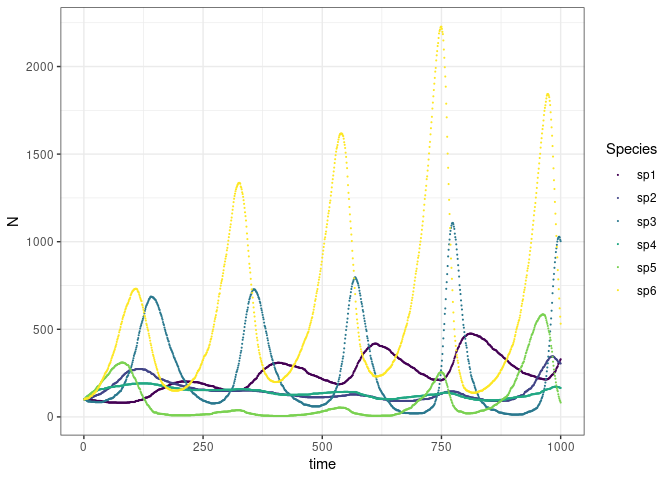

<!-- README.md is generated from README.Rmd. Please edit that file -->

# meweasmo R-package: MEta-WEb ASsembly MOdels

[](https://zenodo.org/badge/latestdoi/130283899)

This package simulates the assembly of ecological networks from a
regional metaweb. Two main models are implemented; first the trophic
theory of island biogeography \[2\] with the adition that secondary
extinctions are not fixed but happen with a defined probability. Second
a generalized Lotka-Volterra stochastic model. Species can migrate from
the metaweb and establish the ecological interactions specified in the
metaweb.

License: MIT

## Installation

Using the ‘devtools’ package:

``` r

install.packages("devtools")
library(devtools)
install_github('lsaravia/meweasmo')
library(meweasmo)
```

## Get Started with Generalized Lotka-volterra model

### Simulate a 6 species network without migration

  - Create a metaweb with a Lotka-Volterra interaction matrix structure,
    I added one last column with intrinsic growth rate.

<!-- end list -->

``` r

library(tibble)

parms <- tibble::tribble(
  ~a1,   ~a2,  ~a3,    ~a4,   ~a5,  ~a6,    ~r,
    0,  4e-6, 3e-5,   2e-5,     0,    0,  -0.01,
-1e-5, -1e-4,    0,   1e-4,  6e-5,    0, -0.001,
-1e-4,     0,    0,      0,  6e-5, 5e-5,  -0.01,
-1e-4,  1e-4,    0,  -5e-4, -1e-5,    0,   0.08,
    0, -1e-4,-1e-4,      0, -1e-6,    0,   0.04,
    0,     0,-1e-4,   2e-4,     0,    0,   0.00
)
```

  - Set the initial conditions and simulate the model with no migration
    during 1000 time steps

<!-- end list -->

``` r

library(meweasmo)

yini  <- c(N1 = 100, N2 = 100, N3 = 100, N4 = 100, N5 = 100, N6 = 100)

A <- as.matrix(parms[,1:6])
r<- as.numeric(parms$r)
m <- c(0,0,0,0,0,0)
```

  - We can calculate the proportions of the different types of
    interactions using the metaweb matrix and the vector of species
    present, in this case all species

<!-- end list -->

``` r

calcPropInteractionsGLVadjMat(A,yini)
#> [1] 0.2 0.6 0.0 0.1 0.1
```

  - then run de simultation

<!-- end list -->

``` r

A1 <- metaWebNetAssemblyGLV(A,m,r,yini,1000,0.1)
```

  - Check the results of the simulation: the abundances and the
    proportion of interactions, at the last time step

<!-- end list -->

``` r

A1$STime[,1000]
#> [1] 368 125 555 122  21 284

calcPropInteractionsGLVadjMat(A,A1$STime[,1000])
#> [1] 0.2 0.6 0.0 0.1 0.1
```

  - Plot the time series of the species

<!-- end list -->

``` r

df1 <- as.data.frame(t(A1$STime))
df1$time <- 1:1000
names(df1) <- gsub("V", "sp", names(df1))
 
library(tidyr)
df1 <- gather(df1,key="Species",value="N", sp1:sp6)

library(ggplot2)
ggplot(df1, aes(time,N,colour=Species)) + geom_point(size=0.1) +  theme_bw() + scale_color_viridis_d()
```



## References

1.  Ecological Network assembly: how the regional metaweb influences
    local food webs Leonardo A. Saravia, Tomás I. Marina, Marleen De
    Troch, Fernando R. Momo bioRxiv 340430; doi:
    <https://doi.org/10.1101/340430>

2.  Gravel, D., Massol, F., Canard, E., Mouillot, D., & Mouquet, N.
    (2011). Trophic theory of island biogeography. Ecology Letters,
    14(10), 1010–1016.
    <https://doi.org/10.1111/j.1461-0248.2011.01667.x>
